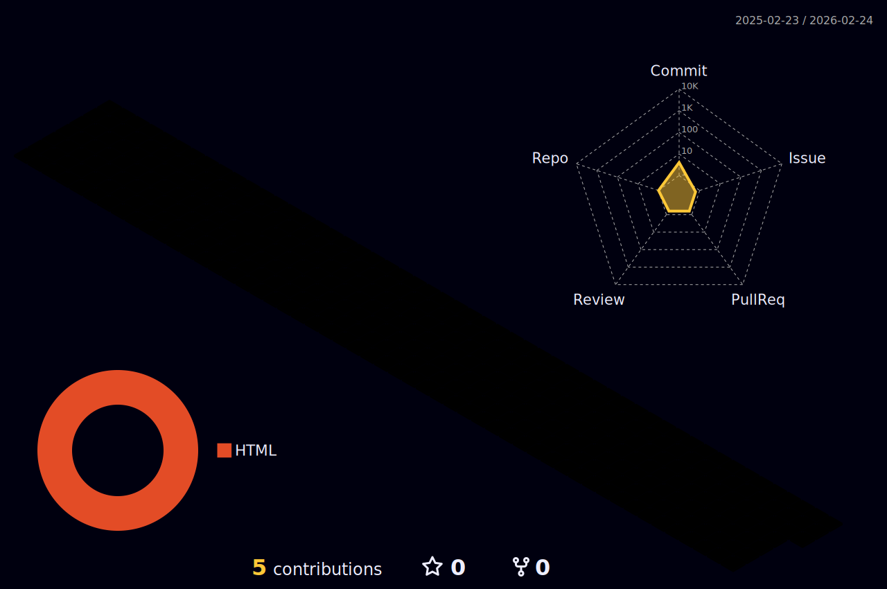

  <!--- stats (start) -->
  

 |  |  |  
 | ----------- | ----------- |

 
Estudante de Desenvolvimento Full Stack na Trybe e um viciado por tecnologia. :beginner: Iniciante buscando aprimorar minhas habilidades e conhecimentos em desenvolvimento web. Tenho paixão por criar projetos divertidos e estou sempre procurando aprender novas tecnologias e técnicas. Se você está interessado em colaborar em projetos ou compartilhar experiências no mundo da programação, sinta-se à vontade para se conectar!

  🦄 Linguagens: 

  

  💼 Ferramentas: 

  

  :muscle: Aprendendo: 

  

  💌 Contatos ⤵️

  
  

 

 

     
  

